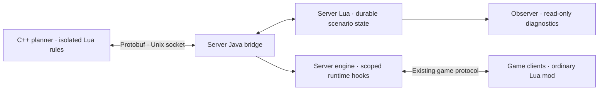

# The Beginning

An experimental Project Zomboid **Build 42** multiplayer scenario: a living civilian
Muldraugh, a host-triggered outbreak, and seven game days of disruption before survivors
settle into an ongoing world. This is original mod code; Bandits remains a separately
installed dependency.

Project repository: [Akryllax/TheBeginningPZ](https://github.com/Akryllax/TheBeginningPZ).
The development workspace currently remains in `Documents/Projects/ZomboidDayOne`.

## Current status

**Under development; no multiplayer-validated release yet.** The earlier playable prototype
is an observation-only world. It has not been replaced by the new civilian scenario.

Implemented components include a bounded C++20/Lua planner, Protobuf IPC, a server Java
bridge, persistent resident/scenario models, admin controls, a road index, and private
Observer diagnostics. Planner, protocol, Lua domain and JVM fixtures have been exercised.
Those results do not establish visible NPC behavior, safe driving, or two-client consistency.

The current integration work targets ordinary Lua clients and **server-only JVM injection**.
An isolated empty-vehicle test passed native movement, braking and cleanup: the car traveled
10.05 tiles using server physics. This required explicit native server terrain cells.
One connected player then confirmed visible, smooth movement on an ordinary client. The
probe followed a fixed straight strip on the sidewalk; road-following steering is not wired
into it. Client-visible duration and interpolation latency were not measured.
Integration with normal gameplay, collision ownership, NPC seating, unloaded resident
reconciliation, and the full outbreak/adaptive event progression remain incomplete. Native
vehicle packets still need observation from two real clients.
The earlier client Java launcher under `client/` is an experimental prototype and is not the
deployment target. See the [implementation ledger](vault/Experiments/Implementation%20Ledger.md)
and [accepted scenario](vault/Design/First%20Week.md) for requirements and evidence boundaries.

## Architecture



The game owns resident identities, accepted actions, time and persistent effects. The worker
returns bounded plans, never executable game code. Clients execute only the actions assigned
to their confirmed native ownership; shared presentation and handoff still require real
multiplayer validation. Observer cannot control gameplay.

**Core game files are never replaced or patched on disk.** Extensions contain our own Lua
and Java code, with scoped runtime hooks where necessary on the controlled server. We do
not distribute replacement engine classes, decompiled game code, game assets or upstream
Workshop mods. Runtime hooks still require compatibility review after updates.

## Development

Downloads, toolchains, container storage and caches stay under `.tooling/`. Builds and
private inspection output stay under `artifacts/`. Game installation, saves and credentials
are local prerequisites and are excluded from Git. The scripts currently describe the
developer's isolated `.132` deployment; a portable player/server installer is not released.
The separate `.160` game and Observer are outside this project's operations.

```sh
./dayone --help
./dayone test
python3 scripts/build_npc_service.py --test --bundle
python3 scripts/build_scenario_agent.py --test
python3 scripts/build_scenario_map.py
python3 scripts/decompile_java.py zombie.vehicles.VehicleManager
```

Read [Operations](vault/Runbooks/Operations.md) before starting or stopping services.
[Java Inspection](vault/Runbooks/Java%20Inspection.md) describes the pinned local decompiler
and exact-bytecode evidence. [Backup and Restore](vault/Runbooks/Backup%20and%20Restore.md)
covers consistent private backups. Builds and read-only tests do not authorize replacing a
playable world with an unvalidated scenario.

| Directory | Purpose |
| --- | --- |
| `mods/LofersStoryteller/` | Original Lua companion and scenario code |
| `npc-service/`, `protocol/` | C++20 planner, Lua rules and wire contract |
| `scenario-agent/` | Server bridge, guarded runtime hooks and fixtures |
| `observer/` | Independent map/exporter source and private diagnostics |
| `game/`, `gateway/`, `compose.yaml` | Local deployment definitions |
| `scripts/`, `tests/` | Reproducible tools, operations and checks |
| `vault/` | Obsidian-compatible design, runbooks and evidence |
| `.agents/skills/`, `AGENTS.md`, `SKILLS.md` | Project-specific agent workflows |
| `references/` | Tool/source provenance; downloaded upstream material is ignored |

The intended scenario preserves 10× XP, rapid book reading, and player Knox immunity.
Its clock starts manually and pauses while the server is empty. The initial physical limits
are 24 pedestrians, four moving vehicles and 32 residents including occupants. These are
design limits awaiting gameplay profiling, not measured capacity guarantees.

The repository includes the owner's [GPL-3.0 license](LICENSE). Imported Observer source
retains its provenance record; third-party dependencies retain their own licenses and
notices. Workshop publication and a public binary release are not part of this milestone.
