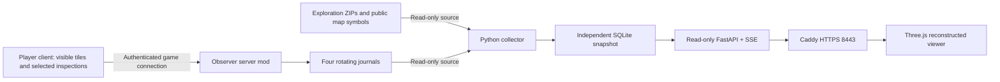

# Current deployment

The public service now runs saved-map mode. See [the README](../README.md) and [saved-map validation](saved-map-validation.md). The architecture below describes the retained, disabled experimental mod implementation.

# Observation pipeline

Only the client visibility test `square:isCanSee(playerNum)` authorizes a tile snapshot; loaded cells and historical exploration flags do not. Scan work is capped at 256 squares and approximately 2 ms per tick. The current floor is scanned within 64 tiles. Unseen objects remain at their last observed state; empty observed tiles create tombstones. A sighting refreshes its observer's cached timestamp, while complete changed tile snapshots update geometry. Actor IDs are session-scoped; vehicle network IDs are translated to persistent SQL IDs on the server.

The server stamps time and observer identity from the game connection, limits packet size/rate and rejects distant tiles. This is a cooperative client observation system, not an anti-cheat proof of line of sight; a malicious modified game client could fabricate its own observations. The public web API cannot ingest data or issue game commands. It has no RCON access.

Client inspections read only the selected visible world-container pane. They never traverse nested bags or character inventory. Separate vehicle slots preserve trunk and seat observations. Mechanical parts are recorded only while the mechanics window is visible. These observations have their own timestamps, so observing a van from the street does not refresh its old cargo information.

Strict Pydantic models accept explicit public fields and reject unknown fields. SQLite stores latest snapshots per observer and combines by last observed timestamp. A newer observation of a relocated vehicle suppresses its older location globally while each observer's view retains their own history. Live marker snapshots replace only that author's publicly shared markers; persisted save files cannot resurrect sharing that the live exporter revoked. Older sessions cannot overwrite newer heartbeat/marker snapshots.

The journal header identifies session and rotation generation. Each record carries protocol version, world, session, sequence, server timestamp, observer and record kind. Replay after a crash is idempotent; incomplete final lines wait for another poll. A missing sequence raises a visible gap notice. The game can keep writing when the viewer is down, subject to the 64 MiB bounded spool.

Historical exploration is decoded from stable byte copies of each player's ZIP, verifying inner username, CRC, version and expected length against runtime world bounds. Two-bit flags retain visited/known distinctions. Symbols are parsed from the versioned shared-symbol file; only everyone-sharing is emitted. The user's previously restored player maps are inputs, not modified by this project.

3D objects are instanced by procedural template for low draw-call counts. Detailed requests are bounded spatial windows and a selected floor; unknown terrain is blank apart from coarse coverage. Roof/wall cutaway and floor controls expose interiors. The viewport has a 40,000-element response cap and reports truncation. Geometry templates approximate dimensions and appearance; arbitrary mod sprites may render as generic objects. The first version is not a photorealistic reconstruction or a full multi-floor scene exporter.
