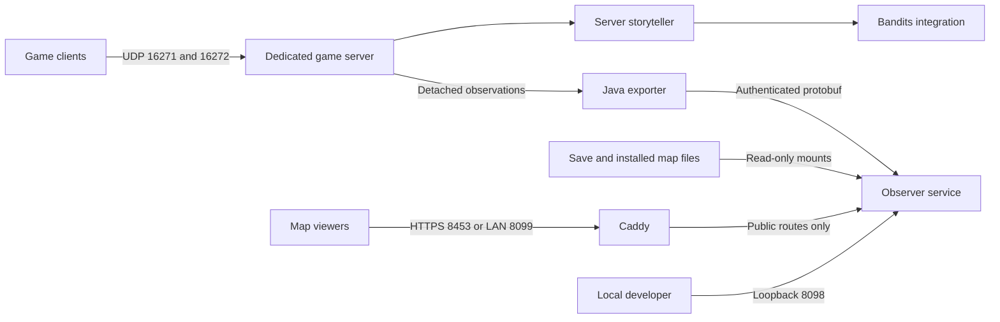

# Architecture

For the current scenario layer, see [[Design/First Week]] and
[[Decisions/0004 Server Runtime Extensions]]. It adds a C++/Lua worker over private Protobuf
IPC and scoped **server-only** runtime Java hooks. Clients use ordinary Lua. Server-owned
vehicle streaming is under investigation; multiplayer driving is not yet validated.
The service layout below also describes the still-running observation prototype.

`AKR_DayOne` is an isolated world on `192.168.1.132`. It uses the existing game's validated build and compatible baseline mods, fresh saves and a separately copied Observer source tree. The original `.160` deployment is not part of this runtime.

## Responsibilities

| Component | Owns | Must not depend on |
| --- | --- | --- |
| Dedicated server | Game simulation, world persistence, client authority | Observer availability |
| LofersStoryteller | Director state, seeded decisions, pacing, inference and event lifecycle | Browser state or web commands |
| Bandits NPC | Upstream NPC behavior and required client integration | Assumed undocumented APIs |
| Java exporter | Guarded, bounded snapshots and asynchronous delivery | A healthy receiver to keep game ticks running |
| Observer | Map collection, fog filtering, shared web planning, debug display | RCON or write access to game files |
| Caddy | HTTPS and the public/private route boundary | Game administration privileges |

The current storyteller includes a client guard that prevents Wandering Zombies from steering Bandit-flagged NPCs. Install the original companion ZIP on each client and load the same version on the dedicated server. **The Java Observer exporter is server-only**. These are different distribution requirements.

## State boundaries

Game state is under `data/Zomboid/`, Observer databases under `data/observer/`, and certificate state under `data/caddy/`. Storyteller decisions and event identifiers persist with the world. Observation/debug snapshots are derived state and can be regenerated. A new world must not reuse old map knowledge, trip history or director state accidentally.

Container storage and language tools are project-local in `.tooling/`. Secrets stay in protected files under `secrets/`, outside source control and mod packages. Dependency source is obtained separately and recorded by version/hash.

See [[Design/Telemetry]], [[Design/Performance Budget]] and [[Runbooks/Operations]].
