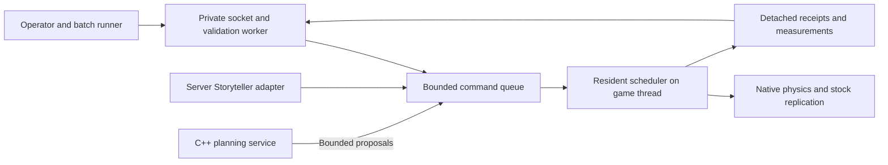

# Live event runtime

The current priority is a persistent event runtime and repeatable test batches, before
resuming the opposing-car experiment. The user requested a reliable iteration framework
that avoids restarting the game for each event, parameter change or compatible behavior
update. The detailed implementation plan is [PLAN_SchedulerAPI.md](../../PLAN_SchedulerAPI.md).
This note records its architectural rationale and boundaries. Implementation and hot reload
have not been validated. Start a new session with [[Experiments/Current State]].

## Why the prototype keeps restarting

`ScenarioAgent.premain` constructs a single `ServerVehicleProbe` from startup properties.
The probe owns one car and its own terrain lifecycle. `vehicle_probe_ops.configure_route`
explicitly refuses route changes while its container runs. `ProbeControl` accepts only
start/stop/inspect through a replaceable latest-command mailbox. These are prototype
constraints, not evidence that Zomboid requires a restart to spawn another event.

The existing server agent already injects a tick bridge. The installed B42.20.4 code also
provides `reloadlua` and server Lua reload functions. The private fixture helper has used
reload to run world-scoped operations during a session. Re-executing a Lua file alone does
not provide versioned state migration, callback cleanup or safe module replacement.

## Resident engine adapter and replaceable behavior

Keep a small, build-guarded server Java adapter loaded at startup. It owns native physics,
terrain leases, managed entity identities, stock replication and the game-thread scheduler.
Do not repeatedly initialize native worlds for individual events or rebase global offsets.
The current collision-map initialization is proven only in the disposable probe; extraction
must establish shared ownership before normal campaign deployment.

JSON event definitions and compatible original behavior modules are replaceable. Java
modules use a fresh classloader per version and a stable parent-loaded interface. They
receive detached observations and return bounded intents; the resident adapter retains
engine objects and native-body ownership. Keep module types, threads and callbacks out of
long-lived game registries. Closing a classloader does not itself unload its classes.

Stage candidates off the game thread, validate interface and state versions, then activate
between events after cleanup. Pin each running event to one version. Keep the previous
known-good module if staging or activation fails. Persistent state stays outside replaceable
closures. Lua uses one permanent dispatcher with replaceable implementations; reload must
not accumulate listeners. Modules are trusted project code, not a security or crash sandbox.

Reflection or cached method handles can call guarded engine APIs; they are not a lifecycle
or reload system. JVM class redefinition can help narrow development fixes, but standard
HotSwap has structural restrictions and does not reinitialize existing state. It should
not be the routine deployment mechanism. Changes to engine hooks, JNI/native ABI, the stable
runtime interface or incompatible game builds may still need a coordinated restart.
No client Java agent, core-file edits, or redistributed game classes are introduced.

## Shared event contract

The operator and future Storyteller use the same submit/status/cancel/outcomes lifecycle.
Reload is operator-only. Reuse Protobuf framing/tooling with a separate runtime protocol and
socket; retain the planner's existing protocol. Use world, server epoch, request ID, event ID
and module version to reject stale input and deduplicate retries within an epoch.

Use a bounded FIFO for commands; a latest-only mailbox remains suitable for replaceable
telemetry, not event submissions. Acceptance is distinct from completion. Reserve capacity
for cancellation, reject excess work explicitly and never wait for socket I/O in a tick.
Initially run one event, at most two moving cars and eight owned entities in total.

Each event records vehicles, fixtures, terrain leases and reservations it owns. Cleanup
must verify both native-body and Java-world removal before the next case. Uncertain cleanup
stops the batch. Intentionally retained aftermath needs an explicit durable owner and result.
A restart interrupts active executions; reconcile tagged objects instead of replaying crashes.
Intentional impacts bypass mutual avoidance only for named participants. Stock collisions,
capabilities and unrelated-actor checks remain active. Test teleportation, forced weather and
brake fault injection stay restricted to disposable-world operator policy.

## Performance and reliability

Parsing, compilation/loading, route planning and reports run off the game thread. World
mutations and native operations remain on it. Share one aggregate incremental-work budget,
with priority for vehicle control, emergency braking and cancellation. Bound operations,
queues, entities, terrain, allocations and observation age; avoid whole-world scans.

Use the existing [[Performance Budget]] targets: roughly 1 ms incremental slices, added-work
p95 below 2 ms and p99 below 5 ms. Measure preparation, spawn, native calls, cleanup, GC and
whole-server tick behavior separately. A deadline cannot preempt a blocking native call, and
a Java module cannot contain a native crash. Use the disposable server and external batch
supervision for those failures. Code rollback does not undo damage already caused in a world.

## Batch acceptance and rollout

Use recorded scenario versions, explicit seeds and parameter matrices. Seeds aid repeatability;
full native simulation is not assumed bit-for-bit deterministic. Unattended batches require
an empty disposable server. Watched batches verify the viewing envelope and wait for an
operator advance between cases. Newly joined players must not be silently teleported.

Run pure geometry/protocol/lifecycle checks first, then real native driving, stopping,
avoidance, static impacts and low-speed two-car contact before faster opposing impacts.
After each case, verify resources and unrelated objects against the applicable baseline.
Generated fixtures can support repeated same-session cases; destructive map tests need fresh
isolated snapshots. Include stale epochs, duplicate submissions, queue saturation, missing
chunks, disconnects, worker outages, module failure and partial cleanup in fault tests.

The planned soak gate is at least 100 cases and 20 reloads without a server-process/epoch
change, checking retired-module references, callbacks, memory trends, tick costs and owned
resource counts. Produce JSON receipts and a readable report. One-client visual/audio
acceptance and two-client replication remain separate gates; neither is replaced by telemetry.

Deploy first to `.132:16281`, with one coordinated installation restart. Automatic Storyteller
scheduling remains disabled during this milestone. The normal `.132` world and `.160`
production deployment are outside this change. See [[Implementation Roadmap]] for subsequent
commute, resident identity and outbreak work.

## Inspected sources

Checked 2026-09-27 against the project-pinned B42.20.4 and Java 25:

- Original project: `ScenarioAgent.java`, `ProbeControl.java`, `ServerVehicleProbe.java`,
  `PlannerTransport.java`, `scripts/vehicle_probe_ops.py`, `scripts/build_scenario_agent.py`.
- Private installed-game inspection: `artifacts/decompiled/probe-fixture-cleanup/` for
  `ReloadLuaCommand`, and `artifacts/decompiled/npc-driver-presentation/` for `LuaManager`.
  Preserve these locally; do not publish decompiled game code.
- [Java 25 Instrumentation](https://docs.oracle.com/en/java/javase/25/docs/api/java.instrument/java/lang/instrument/Instrumentation.html):
  startup/runtime agents, optional redefine/retransform capabilities and retained live state.
- [Java 25 JVMTI class redefinition](https://docs.oracle.com/en/java/javase/25/docs/specs/jvmti.html#RedefineClasses):
  supported changes and restrictions.
- [Java 25 URLClassLoader](https://docs.oracle.com/en/java/javase/25/docs/api/java.base/java/net/URLClassLoader.html):
  separate module loading and close behavior.
