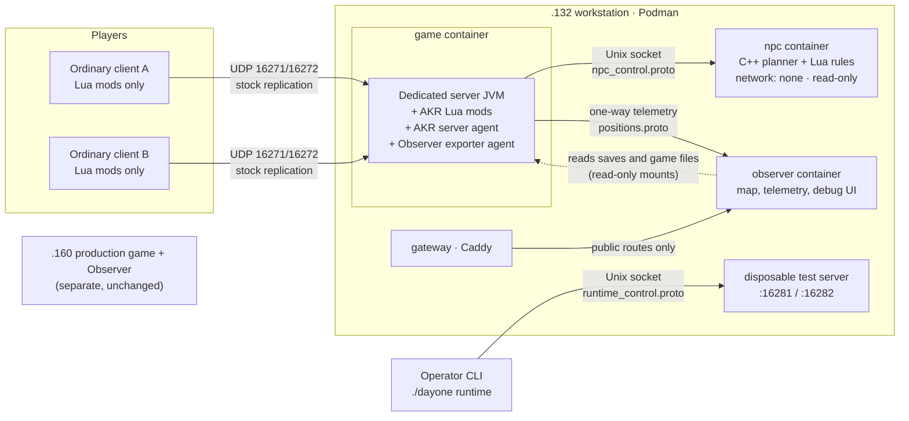
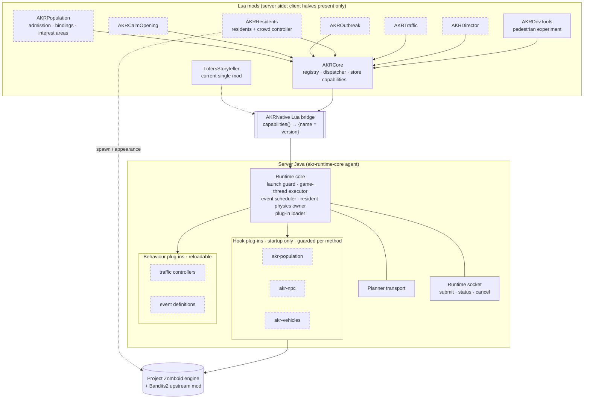
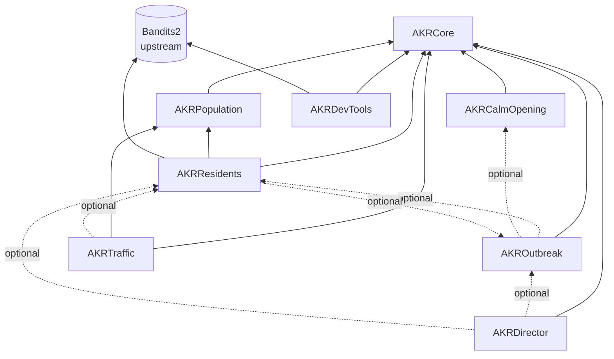
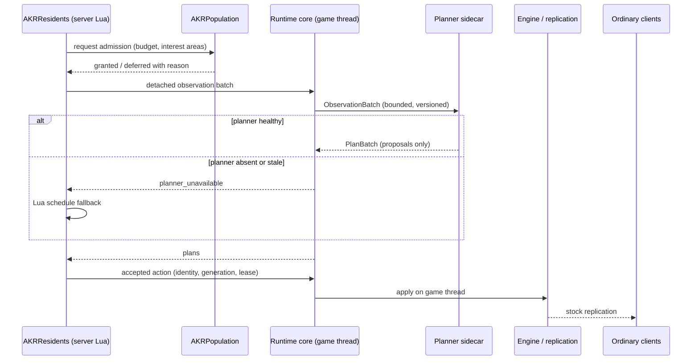
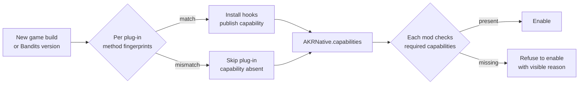
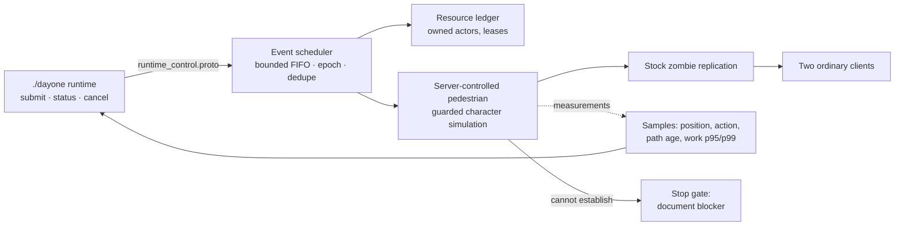

# Service segmentation

Diagrams of the target architecture and the reasoning behind each boundary. It complements
[[Design/Architecture]] (deployment and responsibilities), [[Decisions/0005 Modular AKR Mods]]
(module list and compatibility contracts) and [[Design/NPC First Slice]] (current order).
In the diagrams, **dashed boxes are planned**; solid boxes exist in source today. Existing
source is not in-game evidence; see [[Experiments/Implementation Ledger]].

## Principles

Each boundary exists for one of these reasons, and nothing is split without one:

1. **Authority.** The game server decides every gameplay outcome. Anything that decides must
   run inside the game process, on the game thread, next to the engine objects it changes.
2. **Failure isolation.** Work that can hang, crash natively or exhaust memory goes into a
   separate process that the game can lose without stopping.
3. **Engine coupling.** Code that touches engine internals is grouped by the engine surface it
   touches, so a game update disables only the features whose hooked code changed.
4. **Rate of change.** Code that changes daily (behaviour, parameters) is reloadable; code that
   needs class-load transforms (hooks) is loaded once at startup.
5. **Distribution.** Players install ordinary Lua mods only. Java stays on the server.
6. **Exposure.** Gameplay never depends on telemetry, and nothing reachable from the network
   can issue gameplay commands.

## 1. Deployment

**Why this split.**

- **Game container** holds everything that decides. Bandits, the engine and our logic must
  share the game thread and its objects; putting any of them elsewhere would require copying
  world state across a boundary on every tick.
- **Planner in its own container** (principle 2). It runs natively compiled code and a Lua VM
  per worker, which can hang, crash or leak. It has no network, a read-only filesystem, a
  512 MiB limit and two CPUs. The game treats it as optional: when it is absent, residents fall
  back to server Lua schedules and immediate reactions keep working.
- **Observer outside the game** (principle 6). It receives one-way telemetry and reads saves
  from read-only mounts. If it stops, the game does not notice. The exporter never waits for it.
- **Gateway** separates public map viewing from the loopback-only debug interface.
- **Disposable test server** (`:16281`) runs experiments with its own save and a loopback
  runtime socket, so experiments never touch `AKR_DayOne` or `.160`.

## 2. Inside the game process

Today the hooks, vehicle probe, scheduler and runtime socket live together in one agent,
`scenario-agent` (package `net.lofers.scenario`), behind one set of whole-class hashes.
The plug-in boxes show where that code is meant to move.

**Why this split.**

- **One Java agent, many plug-ins.** Several `-javaagent`s transforming the same classes would
  depend on load order and on each other's bytecode. One core owns all transforms and applies
  each plug-in's hooks only if that plug-in's own checks pass (principle 3).
- **Hook plug-ins grouped by engine surface.** Population hooks touch zombie creation and
  population networking; NPC hooks touch Lua event callbacks and zombie ownership; vehicle hooks
  touch physics, chunks and vehicle packets. A game update that changes vehicle physics then
  disables `akr-vehicles` only.
- **Hooks versus behaviour** (principle 4). Transforms happen when a class loads, so hook code
  cannot be swapped at runtime. Behaviour code receives detached data and returns bounded
  intents, so it can load through a fresh classloader between events without restarting.
- **Runtime core owns shared native resources.** One physics world, one terrain lease table,
  one scheduler. Features borrow them through leases; none creates or tears down its own. That
  is the lesson from the single-car probes, whose private cleanup could not coexist.
- **Lua bridge exposes capabilities, not internals.** Lua sees `AKRNative` functions grouped
  by capability and a version map. It never receives engine internals it could store.

## 3. Lua mod dependencies

Solid arrows are hard requirements in `mod.info`. Dotted arrows are optional lookups through
the core registry (`require(name, major)`), which return a reason instead of failing.

**Why this split.**

- **Core has no gameplay.** It holds only contracts every module needs: versioned lookups, a
  dispatcher that subscribes to each game event once (reload-safe, failures isolated), saved
  state with migrations, and the capability report. Keeping it small keeps it stable, and every
  other mod depends on it.
- **Population is separate from Residents** because residents, crowd extras, traffic drivers and
  staged zombies all consume the same actor budget. If admission lived inside Residents, Traffic
  would depend on Residents just to count bodies.
- **Outbreak does not require Residents.** The seven-day progression can run against vanilla
  zombie pressure, so the story survives if NPC support is disabled by a game or Bandits update.
- **Residents owns Bandits.** It is the only gameplay mod that needs the upstream dependency,
  so a Bandits change affects one mod.
- **Traffic is optional and last.** It carries the most engine coupling and is not required for
  the first slice.
- **DevTools never ships to campaign worlds.** Test fixtures cannot leak into gameplay.

## 4. Authority and planning flow

**Why this shape.** The planner only proposes; the server validates each proposal against the
resident's current identity, generation and lease before anything happens. Observations sent
out are copies, so no engine object leaves the game thread. The fallback means losing the
planner costs richness, not correctness. Clients display what stock replication sends; they
never decide.

## 5. Degradation on a game or dependency update

**Why.** Today one mismatched class disables everything. Checking each plug-in against the
methods it actually hooks means an unrelated engine change stops nothing, and a relevant one
stops only the affected feature. Mods still fail closed: missing a capability they need, they
stay off and say so, rather than running a degraded scenario. Fingerprints narrow false alarms
but do not prove behaviour; each new build still needs fixtures and a native smoke test.

## 6. Current experiment path

This is the [[Design/NPC First Slice]] feasibility test with one, then four pedestrians, driven
by `AKRDevTools` and the runtime socket. Server-owned pedestrian simulation is a hypothesis:
the vault's [[Research/Bandits Compatibility]] records that Bandits AI normally runs on clients.
If movement, authority, collision, replication or cleanup cannot be established, work stops at
the gate; it does not silently fall back to client-owned simulation.

## What is deliberately not split

- **No separate service for population, outbreak or residents.** They need engine objects every
  tick; a process boundary would add copying and latency with no isolation benefit.
- **No second Java agent per feature.** Competing transforms are harder to verify than one host
  with guarded plug-ins.
- **No client Java.** Distribution stays Lua-only for players.
- **No gameplay path through Observer.** It stays read-only and optional.

Revisit a boundary if it forces duplicated state or hooks, or if measured cost shows the
boundary itself (copying, serialisation, IPC) exceeding the game-thread budget.
