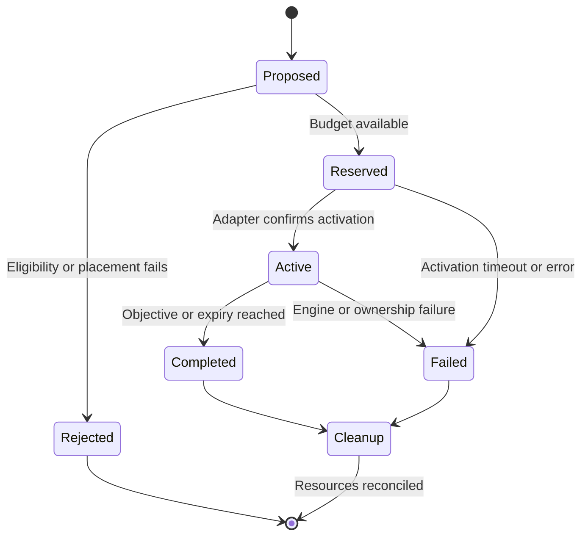

# Storyteller

The intended experience is an ongoing world that responds to a group's growing capacity without immediately erasing progress. Pressure is earned gradually; injury, death and confirmed major loss create recovery time. Early activity suggests a human outbreak; later activity shifts toward scattered survivors and scavengers.

See [[Design/Storyteller Implementation]] for what is implemented. This document describes the accepted design, not a claim that all categories can execute.

## Inputs and pacing

Use world age, online players and capability, smoothed/capped category wealth, recent event outcomes and confident base observations. Inventory totals alone are a poor difficulty signal: abundant low-value supplies must not outweigh recovery or imply that an offline base is eligible for a raid.

The server owns the random stream, event IDs, selection and resource budgets. Clients may display effects or provide the integration required by Bandits, but cannot independently schedule encounters.

| Phase | Default world age | Intended emphasis |
| --- | --- | --- |
| Outbreak | Days 0–7 | Distant conflict, alarms, fleeing groups and confused patrols |
| Aftermath | Days 8–30 | Scavenging groups, skirmishes, supply leads and occasional looters |
| Survival | Day 31 onward | Sparse survivors, resource competition and contextual threats |

These phase boundaries are defaults to tune through play, not scripted deadlines. Event weights should transition smoothly rather than abruptly replacing the world on a particular day.

## Initial limits

- One game day of hostile grace after world start.
- At most one active major hostile event.
- At least six game hours between major hostile events.
- Twenty-four game hours of recovery after player death or confirmed substantial loss.
- At most eight NPCs per encounter and 24 storyteller NPCs globally.
- No raids against offline bases and no backlog burst after reconnect.
- No large fires, nuclear events, or forced character loss.

The detailed event catalog is [[Design/Event Catalog]]. Limits must be checked both when proposing and when activating an event; the world may change between those steps.

## Lifecycle

Each transition records a reason and stable event ID. Activation must be idempotent across repeated hooks and restarts. A failed spawn releases reserved capacity. Lost NPC ownership or missing cleanup confirmation remains visible as unresolved state; blindly releasing that capacity can permit unbounded spawns.

Time-based scheduling pauses while no players are online. Game time controls pacing; monotonic wall time measures work. Missing/unloaded observations do not establish a loss. See [[Design/Spatial Field]] for confidence and [[Decisions/0003 Observation Before Encounters]] for rollout.
